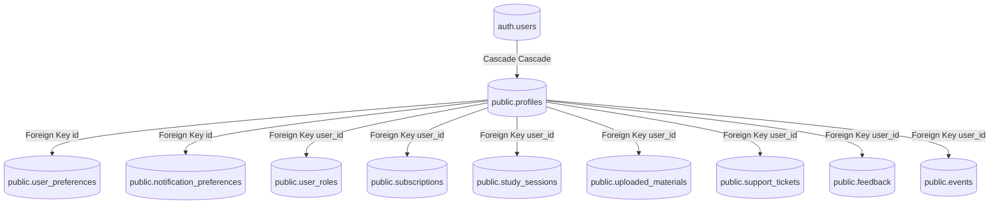

# EduAgent AI — Complete Application Dependency Graph

This document details the relationship mapping and dependency hierarchy across the database, RPCs, API routes, services, and frontend pages of EduAgent AI.

## 🗃️ Database Table Dependencies

The database tables are organized into Core Identity, User Preference Extensions, Activity History, and Admin Telemetry layers:



---

## 📡 RPC to Table Mapping

The custom database aggregation and management functions map to the tables as follows:

| RPC Function | Source Tables | Purpose |
|---|---|---|
| `public.is_admin(user_id)` | `public.user_roles` | Server-side role verification |
| `public.has_role_hierarchy(...)` | `public.user_roles` | Hierarchical permission validation |
| `public.get_admin_stats()` | `profiles`, `study_sessions`, `study_messages`, `uploaded_materials`, `ai_requests`, `subscriptions` | Dashboard Overview statistics |
| `public.get_admin_users(...)` | `profiles`, `auth.users`, `subscriptions`, `user_roles` | Paginated and filtered user list |
| `public.get_admin_user_details(...)` | `profiles`, `user_preferences`, `study_sessions`, `uploaded_materials`, `ai_requests`, `support_tickets`, `feedback` | Admin User detailed audit drawer |
| `public.get_historical_analytics()` | `ai_requests`, `study_sessions`, `auth.users`, `events` | Chronological cost, usage, and traffic charts |

---

## ⚡ API Routes to RPC & Service Dependencies

Below is the API routing to Service Layer execution mapping:

```
[UI Page / Component]
      ↓
[React Component state / SWR]
      ↓
[API Route GET/POST/PATCH]
      ↓
[Domain Service (src/lib/services)]
      ↓
[Supabase PostgREST client / Database RPC]
```

### Detailed Trace

1. **Dashboard Stats**:
   - UI: `OverviewTab.tsx` ➔ `/api/admin/stats` ➔ RPC `get_admin_stats`
2. **User Management**:
   - UI: `UsersTab.tsx` ➔ `/api/admin/users` ➔ RPC `get_admin_users`
   - UI: `UserDetailDrawer.tsx` ➔ `/api/admin/users/[userId]` ➔ RPC `get_admin_user_details`
3. **Historical Performance & Costs**:
   - UI: `AiAnalyticsTab.tsx` / `AnalyticsTab.tsx` ➔ `/api/admin/analytics` ➔ RPC `get_historical_analytics`
4. **Account & Settings**:
   - UI: `account/page.tsx` ➔ `/api/account/usage` ➔ Service `business.ts` & `users.ts` ➔ `profiles` & `user_preferences` tables.
5. **AI Prompt / Chat Generator**:
   - UI: `/chat` / `StudySession` ➔ API Endpoint / Chat Client ➔ Service `src/lib/chat/service.ts` ➔ `profiles` / `user_preferences` / `uploaded_materials` / Gemini API.
6. **Telemetry & Tracking**:
   - UI: Page interactions / actions ➔ Utility `tracker.ts` ➔ writes directly to `events` table (normalized).
