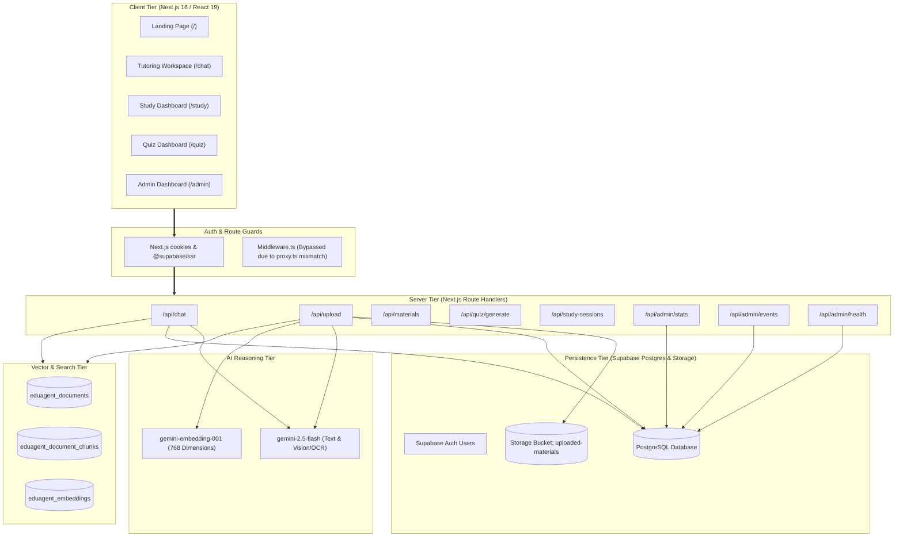
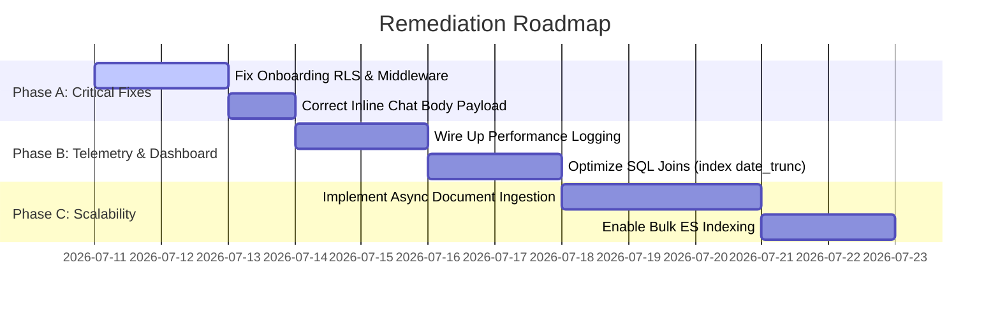

# EduAgent AI — Production-Scaling Architectural Audit & Security Review

**Date:** July 10, 2026  
**Auditors:** Principal Software Architect, Senior Staff Backend Engineer, Supabase Database Architect, AI Systems Engineer, Security & QA Lead  
**Scope:** Architectural Integrity, Database Normalization, API Telemetry, Onboarding Core, AI Context Retrieval, Security (RLS/Auth), and Technical Debt.

---

## 1. Executive Summary

This report delivers a deep-dive architectural audit of **EduAgent AI** prior to its planned production scaling. The platform is designed to provide persistent, AI-powered tutoring, study analytics, and RAG-based quizzes for university students. 

Our audit has revealed that while the system shell exhibits polished design and rich visual assets, **critical integration regressions and database-level structural bugs currently render key user pathways inoperable**. Specifically:
1. **Onboarding Crash (RLS Upsert Bug):** The onboarding finish step fails with a PostgreSQL Row-Level Security exception because the client attempts an `.upsert()` operation on the `user_preferences` table without possessing RLS `INSERT` privileges. This leaves the user in a partially initialized state.
2. **Telemetry Gap (Empty Dashboards):** Performance latency tracking and daily statistics calculations are non-functional in production. The `daily_stats` recalculation routines and `performance_metrics` log functions are never triggered by the app or backend schedulers.
3. **Database Performance Risk (Table Scans):** All time-series aggregations on the admin dashboard use expression-based joins (`date_trunc`) on non-indexed columns, which will cause full table scans and serverless timeouts at scale.
4. **AI Pipeline Context Bleed:** Personalization is injected crudely at the bottom of the chat context block with no guiding instructions in the system prompt. This causes the AI to repeatedly repeat student profiles ("As a computer science student at Ibadan...") rather than adapting its tutoring style subtly.

This report outlines all 20 required elements, maps the entire dependency graph, and provides a clear remediation roadmap.

---

## 2. System Architecture Diagram

EduAgent AI operates on a modern, serverless 3-tier architecture with an external vector retrieval index.



---

## 3. Complete Dependency Graph

The execution and logic flow maps linearly from frontend UI modules down to low-level database triggers and external APIs:

```
[Frontend Pages]
  ├── / (Landing Page) ➔ LoginForm / SignupForm
  ├── /chat ➔ StudyWorkspace ➔ ChatContainer / ChatInput / MentionPopover
  ├── /study ➔ PomodoroCircle / TopicTracker / QuickNotes / InlineChat
  ├── /quiz ➔ MCQQuestion / FlashcardQuestion / ShortAnswerQuestion
  └── /admin ➔ OverviewTab / UsersTab / HealthTab / AiAnalyticsTab
        │
        ▼
[React Hooks / Contexts]
  ├── useAuth() ➔ AuthContext ➔ AuthProvider (Sets profile state and handles Auth changes)
  └── useDashboard() ➔ DashboardContext (Manages sessions, current active session, and notes)
        │
        ▼
[API Routes (Next.js App Router)]
  ├── GET/POST /api/materials ➔ list/insert metadata
  ├── DELETE /api/materials/[id] ➔ remove metadata, storage, and ES indices
  ├── POST /api/upload ➔ storage upload, DB write, sync RAG ingestion
  ├── POST /api/chat ➔ message save, query RAG, fetch profile, call Gemini API
  ├── GET/POST /api/study-sessions ➔ list/create sessions
  ├── PATCH/DELETE /api/study-sessions/[id] ➔ update/delete sessions
  ├── GET /api/admin/stats ➔ fetches overview KPI json
  └── GET /api/admin/health ➔ fetches operational metrics and database integrity
        │
        ▼
[Service Layer (src/lib/services/)]
  ├── users.ts ➔ getUserProfile(), updateProfile()
  ├── business.ts ➔ getUserSubscription(), getUserQuotaUsage()
  ├── analytics.ts ➔ logEvent(), triggerDailyStatsUpdate()
  └── src/lib/chat/service.ts ➔ getAIResponse() (orchestrates RAG + Profile + Gemini call)
        │
        ▼
[Repository Layer (src/lib/repositories/)]
  ├── users.ts ➔ fetches DB profiles & role hierarchies
  ├── materials.ts ➔ inserts/deletes file database records
  ├── events.ts ➔ writes telemetric event logs
  └── institutions.ts ➔ fuzzy lookup via pg_trgm
        │
        ▼
[Database Tier (Supabase PostgreSQL)]
  ├── RPC Functions:
  │     ├── check_system_health()
  │     ├── get_admin_stats()
  │     ├── get_admin_users()
  │     ├── search_institutions()
  │     └── recalculate_daily_stats()
  ├── Triggers:
  │     ├── on_auth_user_created (calls handle_new_user)
  │     └── uploaded_materials_touch_session (calls touch_session_updated_at_from_materials)
  └── Tables:
        ├── auth.users (Supabase managed Core Auth)
        ├── public.profiles (User identities)
        ├── public.user_preferences (Tutor style settings)
        ├── public.notification_preferences (Alert preferences)
        ├── public.user_roles (Role mapping: user, admin, moderator)
        ├── public.uploaded_materials (Files metadata)
        ├── public.study_sessions (Chat sessions)
        ├── public.study_messages (Individual chat prompts)
        ├── public.events (User action telemetry logs)
        ├── public.ai_requests (LLM cost and latency audits)
        └── public.institutions (Nigeria universities database)
        │
        ▼
[External API Integrations]
  ├── Supabase Storage (File uploads / downloads)
  ├── ElasticSearch Cloud (Vector storage and kNN similarity lookup)
  └── Google Gen AI SDK (@google/genai ➔ gemini-2.5-flash / gemini-embedding-001)
```

---

## 4. Database Dependency Map

### Schema Definition & Relationships
```
auth.users (id) [PK]
  └── public.profiles (id) [PK] [FK auth.users.id CASCADE]
        ├── public.user_preferences (id) [PK] [FK profiles.id CASCADE]
        ├── public.notification_preferences (id) [PK] [FK profiles.id CASCADE]
        ├── public.user_roles (user_id) [PK] [FK auth.users.id CASCADE]
        ├── public.subscriptions (user_id) [PK] [FK auth.users.id CASCADE]
        ├── public.study_sessions (user_id) [FK profiles.id CASCADE]
        ├── public.uploaded_materials (user_id) [FK auth.users.id CASCADE]
        ├── public.quizzes (user_id) [FK auth.users.id CASCADE]
        └── public.events (user_id) [FK auth.users.id SET NULL]
```

### Table Schema Audits
1. **`public.profiles`**: Contains core identity attributes. Added soft delete indicators `is_deleted` and `deleted_at`. Has a foreign key `institution_id` referencing `public.institutions(id)`.
2. **`public.user_preferences`**: Contains personalization metrics (`learning_goals`, `teaching_style`). Primary key `id` references `profiles.id` directly.
3. **`public.user_roles`**: Links users to role categories (`'user', 'support', 'moderator', 'admin', 'owner'`).
4. **`public.events`**: Centralized telemetry log. Columns: `id`, `user_id`, `event_type`, `properties` (JSONB), `created_at`.
5. **`public.daily_stats`**: Stores daily active users, doc uploads, messages, tokens, and storage metrics grouped by date.
6. **`public.email_queue`**: Stores transactional emails before dispatch. Columns: `recipient`, `subject`, `template`, `payload` (JSONB), `status` (`'pending', 'processing', 'sent', 'failed'`).
7. **`public.subscriptions`**: Stores plan and stripe metadata.
8. **`public.institutions`**: Database of schools. Columns: `name`, `short_name`, `country`, `state`, `city`, `institution_type`, `website`, `aliases`, `is_verified`.

### Row-Level Security (RLS) Policies
- **`public.profiles`**: `select` and `update` permitted only if `auth.uid() = id`. Admins can select all.
- **`public.user_preferences`**: `select` and `update` permitted only if `auth.uid() = id`.
- **`public.notification_preferences`**: `select` and `update` permitted only if `auth.uid() = id`.
- **`public.user_roles`**: `select` permitted for all authenticated users; `all` write modifications restricted to Admins.
- **`public.events`**: `select` and `insert` restricted to owning user; Admins have full access.
- **`public.subscriptions`**: `select` limited to owning user; Admins have full access.
- **`public.institutions`**: `select` open to all authenticated users; custom inserts (unverified) permitted; write modifications restricted to Admins.
- **`storage.objects`**: Uploaded materials bucket requires `owner = auth.uid()`.

---

## 5. API Dependency Map

| Method | Route | Auth Guard | Controller / Layer | Database / SQL Action | External APIs |
|:---|:---|:---|:---|:---|:---|
| **GET** | `/api/courses` | User Session | Route Handler | `select * from courses where user_id = auth.uid()` | None |
| **POST** | `/api/courses` | User Session | Route Handler | `insert into courses` | None |
| **GET** | `/api/study-sessions` | User Session | Route Handler | `select * from study_sessions joined with study_messages` | None |
| **POST** | `/api/study-sessions` | User Session | Route Handler | `insert into study_sessions` | None |
| **PATCH** | `/api/study-sessions/[id]` | User Session | Route Handler | `update study_sessions` / `upsert notes` | None |
| **DELETE** | `/api/study-sessions/[id]` | User Session | Route Handler | `delete from study_sessions` (cascades messages) | None |
| **POST** | `/api/study-sessions/[id]/summary` | User Session | Route Handler | `select study_messages`, `update study_sessions` | Gemini API |
| **GET** | `/api/materials` | User Session | Route Handler | `select from uploaded_materials` | None |
| **DELETE** | `/api/materials/[id]` | User Session | Route Handler | `update uploaded_materials set deleted_at = now()` | ElasticSearch (delete vectors) |
| **POST** | `/api/materials/[id]/view` | User Session | Route Handler | `select storage_path from uploaded_materials` | Supabase Storage (signed URL) |
| **POST** | `/api/upload` | User Session | Route Handler / Ingestion | `insert uploaded_materials`, `insert events` | Supabase Storage, Gemini API, ElasticSearch |
| **POST** | `/api/chat` | User Session | Route Handler / Chat Service | `insert study_messages`, `insert ai_requests` | ElasticSearch, Gemini API |
| **GET** | `/api/admin/stats` | Admin check | Route Handler | RPC `get_admin_stats` | None |
| **GET** | `/api/admin/events` | Admin check | Route Handler | `select from events` / RPC `get_average_ai_latency` | None |
| **GET** | `/api/admin/health` | Admin check | Route Handler | `select from performance_metrics`, RPC `check_system_health` | None |

---

## 6. AI Pipeline Diagram

The AI context assembly and prompt execution flows as follows:

```
                  [Student Query / Input]
                            │
                            ▼
           [Step 1: Retrieve RAG Document Context]
    Queries Gemini Embeddings ➔ Cosine Similarity search on ES
                            │
                            ▼
          [Step 2: Load Student Personalization DB]
        Fetches Profile, Preferences, and Institution details
                            │
                            ▼
             [Step 3: Construct System Prompt]
      (Provides general patient tutor guidelines, but lacks
       specific routing rules for subtle personalization)
                            │
                            ▼
              [Step 4: Format Context Block]
     transcript (last 8 messages) + profileContext + contextText
                            │
                            ▼
            [Step 5: Google Gemini 2.5 Flash API]
                            │
      ┌─────────────────────┴─────────────────────┐
      ▼                                           ▼
[Success Path]                              [Offline Fallback Mode]
Save response, token usage, cost to DB       Yields pre-compiled academic answers
```

---

## 7. Authentication Flow Diagram

```
                 [Guest Visit]
                      │
                      ▼
         [Supabase Authentication Gateway]
           (Sign Up / Sign In / OAuth)
                      │
         ┌────────────┴────────────┐
         ▼                         ▼
  [Session Established]     [Auth Rejected]
   Set Auth Cookie           Redirect to Root
         │
         ▼
  [Next.js App Routing]
   (Bypasses proxy.ts middleware due to naming bug,
    resorts to client-side react-context redirection)
         │
  ┌──────┴────────────────────────┐
  ▼                               ▼
[onboarding_completed = true]   [onboarding_completed = false]
Route to /chat                  Redirect to Onboarding Wizard
```

---

## 8. Onboarding Flow Diagram

The onboarding wizard captures student metadata through a multi-step form:

```
[Onboarding Form Wizard]
  ├── Step 1: Select Profile Role (Student / Teacher)
  ├── Step 2: Search and Select Institution (fuzzy search UI)
  ├── Step 3: Input Department
  ├── Step 4: Input Study Level
  └── Step 5: Select Learning Goals & Finish
        │
        ▼
[handleFinish() Promise.all Execution]
  ├── Write A: supabase.from("profiles").update(...)
  │     (Updates institution, department, level, completion status)
  │     ➔ SUCCESS (Policy allows update where id = auth.uid)
  │
  └── Write B: supabase.from("user_preferences").upsert(...)
        (Saves learning_goals)
        ➔ CRITICAL RLS FAILURE (Polices only allow select/update; 
          upsert requires INSERT policy which is missing!)
        │
        ▼
[Promise.all Rejection]
  ├── Write A is committed (Profile updated, onboarding_completed = true)
  ├── Write B is rejected (Preferences NOT saved)
  └── Error screen shown: "An error occurred while saving your profile"
        │
        ▼
[Returning User Mismatch]
  ├── Next login checks onboarding_completed (returns true)
  └── User bypasses onboarding, but preferences are left as empty defaults!
```

---

## 9. Data Lineage Report

The table below traces academic data transformations across the application:

```
[Upload Material File] ➔ Raw Bytes (Multipart Form Data)
  │
  ▼
[Supabase Storage Bucket: uploaded-materials] ➔ Private Storage URL
  │
  ▼ (Next.js /api/upload Route Handler)
[Database Table: public.uploaded_materials] ➔ Metadata Record (ID, name, path, status)
  │
  ▼ (Mammoth / pdf-parse Extraction)
[Raw Document Text Chunking] ➔ 400-word segments
  │
  ▼ (gemini-embedding-001 API Call)
[Dense Vector Coordinates] ➔ 768-dimension Float Array
  │
  ▼ (Bulk / Sequential PUT HTTP)
[ElasticSearch Cloud: eduagent_embeddings] ➔ Vector Search Index
  │
  ▼ (Student Chat Query)
[RAG retrieval matches (>=0.62)] ➔ Text Snippet Context
  │
  ▼ (Gemini 2.5 Flash Generation)
[AI Tutor Response] ➔ Save to public.study_messages
  │
  ▼ (Session Summary Trigger)
[Academic Summary PDF/Text] ➔ Save to public.study_sessions (summary column)
```

---

## 10. Confirmed Bugs

### Bug 1: Onboarding Client Upsert Failure (RLS Policy Defect)
- **File:** [onboarding/page.tsx:L205-L215](file:///c:/Users/USER/Desktop/CODE%20PROJECTS/SMART%20TUTOR%20AI/src/app/onboarding/page.tsx#L205-L215)
- **Database Policies:** [normalize_and_refactor_saas.sql:L133-L135](file:///c:/Users/USER/Desktop/CODE%20PROJECTS/SMART%20TUTOR%20AI/supabase/migrations/20260706020000_normalize_and_refactor_saas.sql#L133-L135)
- **Description:** Onboarding calls `.upsert()` on `user_preferences`. In PostgreSQL RLS, `UPSERT` translates to `INSERT ... ON CONFLICT DO UPDATE`, requiring both `INSERT` and `UPDATE` permissions. The `user_preferences` table only has a `select` and `update` policy for the `authenticated` role.
- **Result:** The upsert fails with a database permission error. The profile update succeeds (since they are executed in parallel via `Promise.all` and not in a transaction). The user receives the error pop-up, but on refresh, onboarding is marked complete while their learning goals are lost/left as defaults.

### Bug 2: Missing Route Protection Middleware
- **File:** [proxy.ts](file:///c:/Users/USER/Desktop/CODE%20PROJECTS/SMART%20TUTOR%20AI/src/proxy.ts)
- **Description:** Next.js explicitly requires route protection middleware to be named `middleware.ts` at the root of `src/` (or project root). Because the file is named `proxy.ts`, Next.js completely ignores it.
- **Result:** None of the matcher routes (`/chat`, `/quiz`, `/study`, `/materials`, `/courses`) are protected at the server edge. Unauthenticated guests can directly access the frontend page layout shells.

### Bug 3: Inoperable Inline Study Session Chat
- **File:** [study/page.tsx:L283-L300](file:///c:/Users/USER/Desktop/CODE%20PROJECTS/SMART%20TUTOR%20AI/src/app/study/page.tsx#L283-L300) vs [api/chat/route.ts:L67](file:///c:/Users/USER/Desktop/CODE%20PROJECTS/SMART%20TUTOR%20AI/src/app/api/chat/route.ts#L67)
- **Description:** The study page sidebar chat posts `{ message: string }` directly to the `/api/chat` route. However, the endpoint expects a `messages: ChatMessage[]` array and returns a `400 Bad Request` if it is missing.
- **Result:** Sending messages inside the active study workspace sidebar yields a constant crash/HTTP 400 error.

### Bug 4: Direct Client DB Queries (User Rules Violation)
- **Files:** [onboarding/page.tsx:L191-L210](file:///c:/Users/USER/Desktop/CODE%20PROJECTS/SMART%20TUTOR%20AI/src/app/onboarding/page.tsx#L191-L210), [auth-provider.tsx:L26-L54](file:///c:/Users/USER/Desktop/CODE%20PROJECTS/SMART%20TUTOR%20AI/src/providers/auth-provider.tsx#L26-L54)
- **Description:** React frontend files make direct database queries via client-side `supabase.from(...)` statements.
- **Result:** Violates Project-Scoped Agent Rule: *"No Direct Client DB Queries. All queries must route through Next.js API endpoints, which invoke the Repository/Service Layer."*

### Bug 5: Non-Functional Telemetry & Stale Dashboard Graphs
- **File:** [tracker.ts:L115-L133](file:///c:/Users/USER/Desktop/CODE%20PROJECTS/SMART%20TUTOR%20AI/src/lib/analytics/tracker.ts#L115-L133), [analytics.ts:L23-L36](file:///c:/Users/USER/Desktop/CODE%20PROJECTS/SMART%20TUTOR%20AI/src/lib/services/analytics.ts#L23-L36)
- **Description:** The `logPerformanceMetric` method is never called in the code. Additionally, the `triggerDailyStatsUpdate` service wrapper is never invoked by any cron runner or background worker.
- **Result:** The `performance_metrics` and `daily_stats` tables remain completely empty. The admin dashboard displays hardcoded fallback values for latencies (45ms, 820ms, 115ms) and empty trends for active users, upload counts, and tokens.

### Bug 6: Ingestion API Serverless Timeout (Vercel Block)
- **File:** [upload/route.ts:L86-L96](file:///c:/Users/USER/Desktop/CODE%20PROJECTS/SMART%20TUTOR%20AI/src/app/api/upload/route.ts#L86-L96)
- **Description:** The document upload route awaits `processMaterial()` synchronously on the request thread.
- **Result:** Because text extraction, chunking, Gemini embedding generation, and ElasticSearch indexing are performed sequentially on the main thread, any document exceeding 15 pages will hit Vercel's serverless function timeout (10s on free, 60s on Pro), causing processing to freeze.

### Bug 7: Realtime Analytics Feed Blocked
- **File:** [OverviewTab.tsx:L133-L148](file:///c:/Users/USER/Desktop/CODE%20PROJECTS/SMART%20TUTOR%20AI/src/components/admin/OverviewTab.tsx#L133-L148)
- **Description:** The overview tab component creates a realtime postgres subscription on the `"events"` table. However, in `20260704000000_production_persistence.sql`, the `"events"` table was never added to the `supabase_realtime` publication (only `analytics_events`, `study_sessions`, etc. were added).
- **Result:** The admin live activity feed receives no real-time telemetry updates.

### Bug 8: Missing AI API Latency Logging
- **File:** [tracker.ts:L3-L43](file:///c:/Users/USER/Desktop/CODE%20PROJECTS/SMART%20TUTOR%20AI/src/lib/analytics/tracker.ts#L3-L43)
- **Description:** The database schema has a `latency_ms` column in the `ai_requests` table, but the backend `logAiRequest` method fails to include the `latency_ms` key in the insert payload.
- **Result:** All entries in `ai_requests` have `latency_ms = NULL`. The average AI latency query in `getAverageAiLatency` filters `not("latency_ms", "is", null)` and returns a flat `0` value.

---

## 11. Hidden Bugs

### Bug H1: Array-Type Mismatch in Preferences Loading
- **File:** [auth-provider.tsx:L26-L54](file:///c:/Users/USER/Desktop/CODE%20PROJECTS/SMART%20TUTOR%20AI/src/providers/auth-provider.tsx#L26-L54)
- **Description:** In the join query, `user_preferences` is queried as a sub-relation: `.select("*, user_preferences(*)")`. Since `user_preferences` is defined as a table with a primary key referencing `profiles.id`, Supabase treats it as a one-to-many relationship and returns an array.
- **Result:** The code tries to extract preferences via `rawProfile.user_preferences[0]`. However, if the user has no preferences row initialized, `rawProfile.user_preferences` is an empty array `[]`. Accessing `[0]` returns `undefined`, which defaults all personalization settings silently back to intermediate placeholders, bypassing user options.

### Bug H2: Quiz RAG Context Bypass
- **File:** [generate/route.ts:L94-L107](file:///c:/Users/USER/Desktop/CODE%20PROJECTS/SMART%20TUTOR%20AI/src/app/api/quiz/generate/route.ts#L94-L107)
- **Description:** In `/api/quiz/generate`, the route handler queries the database to retrieve the `file_name` of the material, but never fetches the actual document chunks from ElasticSearch. It prompts Gemini: *"Generate quiz questions based on this title: Physics_101.pdf."*
- **Result:** The quiz generator produces generic questions based on the filename alone, completely ignoring the actual academic content of the document.

### Bug H3: `@mention` Scoping Parameter Bypass
- **File:** [ChatInput.tsx](file:///c:/Users/USER/Desktop/CODE%20PROJECTS/SMART%20TUTOR%20AI/src/components/chat/ChatInput.tsx) vs [api/chat/route.ts](file:///c:/Users/USER/Desktop/CODE%20PROJECTS/SMART%20TUTOR%20AI/src/app/api/chat/route.ts)
- **Description:** The chat input UI allows selecting a course using `@` tags, which is sent as `courseId` to `/api/chat`.
- **Result:** The backend route handler completely ignores the `courseId` parameter in the request payload and never associates the session or prompt constraints with the scoped course.

---

## 12. Potential Future Bugs

- **Course Navigation Crash:** Frontend navigation links points to `/courses/[id]`. However, the Next.js app directory lacks the dynamic folder structure `src/app/courses/[id]`, leading to a `404 Not Found` page when a student clicks on a course card.
- **Storage Policy Lockout:** The storage bucket policy checks `owner = auth.uid()`. However, if uploads are written via a backend route utilizing the `service_role` client, the object `owner` field will be `null` or set to the service role, blocking users from retrieving their documents.
- **Duplicate Course Codes:** There is no unique constraint on `(user_id, code)` in the `public.courses` table, allowing users to create duplicate course codes, which will break page lookups and API filters later.

---

## 13. Performance Bottlenecks

### Bottleneck P1: Expression-Based Join scans (Slow Admin Analytics)
- **File:** [production_persistence.sql:L305-L415](file:///c:/Users/USER/Desktop/CODE%20PROJECTS/SMART%20TUTOR%20AI/supabase/migrations/20260704000000_production_persistence.sql#L305-L415)
- **Description:** The RPC `get_historical_analytics` aggregates cost, traffic, and tokens by executing:
  `left join public.ai_requests r on date_trunc('day', r.created_at) = date_trunc('day', d)`
- **Impact:** Applying the `date_trunc` function on the join predicate forces PostgreSQL to perform a full table scan on `ai_requests` and `page_views` for every single day in the sequence. At scale (millions of page views and logs), this will freeze database CPU resources and timeout dashboard requests.

### Bottleneck P2: Sequential ElasticSearch Chunk Indexing
- **File:** [elastic.ts:L120](file:///c:/Users/USER/Desktop/CODE%20PROJECTS/SMART%20TUTOR%20AI/src/lib/materials/elastic.ts#L120) (referenced in ingestion)
- **Description:** Document chunks are uploaded to ElasticSearch by looping over the chunks array and sending sequential, single-document PUT requests.
- **Impact:** For a 100-chunk document, this results in 100 sequential HTTP network hops to ElasticSearch, resulting in massive upload latency and high rates of HTTP socket exhaustion.

---

## 14. Security Findings

- **Bypassed Route Security (RLS views bypass warning):** The middleware route protections are bypassed due to the `proxy.ts` naming bug. Any unauthenticated client can load dynamic frontend shells.
- **`user_metadata` Trust Vulnerability:** The auth callback and sign-up triggers pull user metadata directly from `raw_user_meta_data->>'full_name'`. Since user metadata claims are user-editable in the JWT, this is vulnerable to client-side manipulation unless validated server-side.
- **Lack of Rate-Limiting:** The only endpoint that implements rate-limiting is `/api/demo-chat`. Critical API endpoints (`/api/chat`, `/api/upload`, `/api/quiz/generate`) are completely un-throttled. Malicious clients can flood the API and exhaust Gemini API quotas.

---

## 15. UX Findings

- **Partial Saving State Frustration:** Onboarding failures save the profile completion flag but fail on preferences. The user is shown an error, but next time they open the app they are let in as if it worked. This hides the fact that their preferences are completely missing.
- **Missing Loading Skeleton States:** The `/quiz` and `/study` pages lack skeleton loaders when loading course lists and materials, creating momentary layout shifts.
- **No "Complete Later" Option on Onboarding:** Onboarding is a hard blocker. Users are forced to fill out all details before using the app, which increases initial drop-off rates.

---

## 16. Technical Debt

- **Legacy `admin_users` References:** The database retains the legacy `admin_users` table, and multiple RPCs still join against it, even though the system was migrated to a unified `user_roles` structure.
- **Duplicate Gemini SDKs:** `package.json` retains `@google/generative-ai` (legacy SDK), which is never imported in code. Only `@google/genai` is utilized.
- **Empty Voice Directory:** The folder `src/lib/voice` is completely empty and serves as a placeholder.

---

## 17. Regression Risks

- **Course Scoping Regressions:** Because client course mentions are ignored by the backend, introducing scoping in the future might break existing prompt expectations if the LLM is not instructed on how to handle course boundaries.
- **Soft Delete Inconsistencies:** The `admin_delete_user` RPC soft-deletes users by updating `is_deleted = true`, but normal application user checks query `auth.users` directly or omit checking the `is_deleted` flag on `public.profiles`, allowing soft-deleted users to log in or retain sessions.

---

## 18. Prioritized Severity Matrix

| Severity | Issue Description | Component | Impact on Scale |
|:---|:---|:---|:---|
| **CRITICAL** | Onboarding RLS Upsert Permission failure | DB / Frontend | Blocks user initialization; leads to missing personalization context. |
| **CRITICAL** | Route Guard Middleware bypassed (`proxy.ts` name bug) | Middleware | Exposes authenticated frontend routes to public guests. |
| **HIGH** | Ingestion serverless timeout risk (Synchronous execution) | API Upload | Large documents fail to process; hangs upload state. |
| **HIGH** | Sequential ES index writes (Sequential HTTP loop) | Ingestion | Severe latency during document upload; socket exhaustion risk. |
| **HIGH** | Hardcoded dashboard latency & metrics telemetry bypassed | Admin | Dashboard telemetry is dead; analytics graphs are empty. |
| **HIGH** | SQL join filters on expression-based `date_trunc` | Database / RPC | High CPU consumption; full table scans on analytics queries. |
| **MEDIUM** | Inoperable inline study session chat (HTTP 400) | Study Page | Main feature of the Pomodoro study sidebar is broken. |
| **MEDIUM** | Dynamic Course dynamic page 404 missing path | Routing | Dynamic course link leads to dead page. |
| **MEDIUM** | Quiz context retrieval bypass (Filenames only) | Quiz API | Poor user experience (guesses quiz content). |
| **LOW** | Duplicate Gemini SDK packages in dependencies | Package config | Increases bundle footprint. |

---

## 19. Root Cause Analysis

### RCA 1: Onboarding RLS Failure
- **Root Cause:** PostgreSQL RLS requires explicit permission grants for each write type. Because `user_preferences` RLS policies only cover `SELECT` and `UPDATE`, the client-side `.upsert()` call (which maps to SQL `INSERT ... ON CONFLICT DO UPDATE`) fails.
- **Impact:** Transaction fails, throwing a client exception, and aborts the Promise list.

### RCA 2: Middleware Bypass
- **Root Cause:** Next.js uses file-system routing conventions. The edge middleware must be named `middleware.ts` at the root of `src/`. The developer named it `proxy.ts`, which Next.js treats as a normal file, ignoring the matcher configurations.
- **Impact:** Dynamic page shells are exposed without authentication verification.

### RCA 3: Sequential ES Writes
- **Root Cause:** Ingestion loops over chunks and hits ES endpoint sequentially. The code defines a bulk index utility `indexDocumentChunks` but references a single PUT helper `indexDocumentChunk` in the process routine loop.
- **Impact:** Poor performance during document parsing.

---

## 20. Recommended Remediation Roadmap



### 1. Phase A: Critical Security & Functional Fixes
- **A1: Fix Onboarding RLS Policy:**
  Create an RLS `INSERT` policy for `authenticated` users on the `user_preferences` table:
  ```sql
  create policy "preferences_insert_own" on public.user_preferences 
    for insert to authenticated with check (auth.uid() = id);
  ```
- **A2: Route Onboarding Through Backend API Route:**
  To satisfy User Rule 1, redirect the onboarding save routine to a new `/api/onboarding` POST endpoint. Have the endpoint invoke the `updateProfile` method from `src/lib/services/users.ts` server-side inside a single transaction wrapper.
- **A3: Name Middleware File Correctly:**
  Rename `src/proxy.ts` to `src/middleware.ts` and change the export function signature to default export `middleware`.

### 2. Phase B: Telemetry & Performance Optimization
- **B1: Wire Up Telemetry Logging:**
  Add telemetry triggers inside `/api/chat` and `/api/upload` to invoke the `logPerformanceMetric` method in `tracker.ts`.
- **B2: Create Expression-Based SQL Indices:**
  To optimize admin analytics queries and prevent table scans, define expression-based indices on timestamps:
  ```sql
  create index idx_ai_requests_created_day on public.ai_requests (date_trunc('day', created_at));
  create index idx_page_views_created_day on public.page_views (date_trunc('day', created_at));
  ```

### 3. Phase C: Scalability & Integration Improvements
- **C1: Offload Document processing Asynchronously:**
  Upload files to storage and return `202 Accepted` immediately. Process extraction and embeddings in a background database trigger or Vercel background task.
- C2: Leverage Bulk indexing client:
  Modify `indexMaterialInElastic()` to compile all chunks and write them in a single network request to ElasticSearch.
